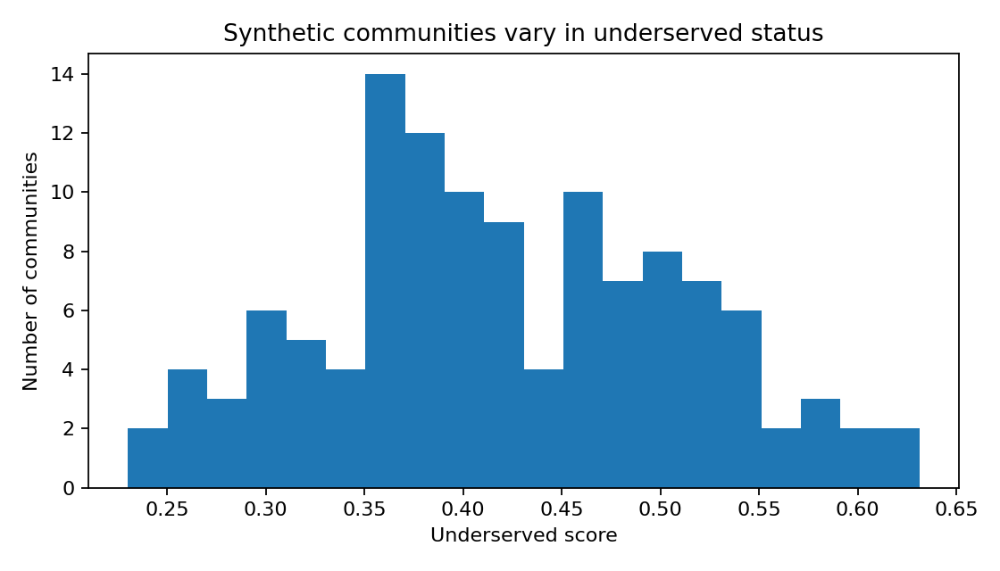
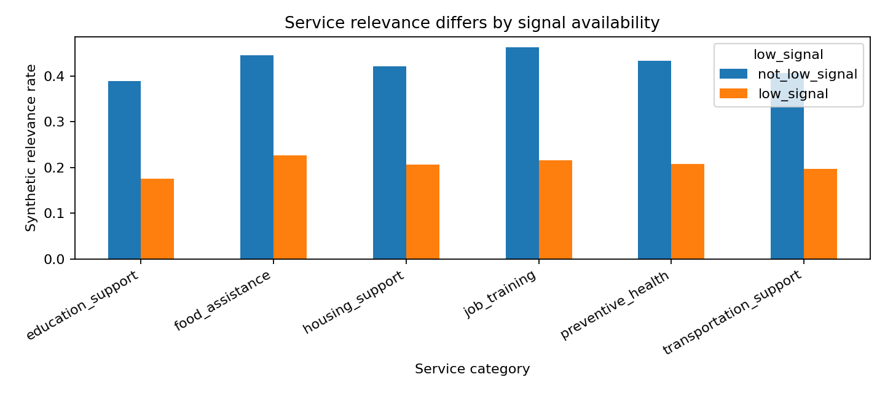

# FairPrivacySignal

FairPrivacySignal is a public, non-confidential synthetic-data benchmark for studying privacy-preserving and fairness-aware AI ranking and matching systems under signal loss.

Many AI systems rely on user-level behavioral signals to decide which services, resources, or recommendations should be shown to people or communities. Privacy requirements, consent restrictions, data minimization rules, and reduced access to tracking signals can remove or weaken those signals. While these protections are important, signal loss can also reduce model utility and may disproportionately affect small, low-signal, or underserved participants.

This project demonstrates a simple, reproducible public-service outreach scenario: matching communities or households to relevant public services such as preventive health outreach, food assistance, housing support, job training, and education resources. The project uses synthetic data, optionally calibrated with public aggregate datasets, to show how privacy-preserving transformations and fairness-aware evaluation can reduce reliance on raw personal data while preserving useful ranking performance.

The same technical pattern can apply to public agencies, healthcare outreach, nonprofit service delivery, education programs, local marketplaces, and small-business discovery systems.

## What this project demonstrates

- Synthetic public-service ranking and matching data generation
- Privacy-driven signal loss simulation
- Consent-aware and policy-aware feature suppression
- Cohort aggregation and k-thresholding
- Differential-privacy-style noise for aggregate features
- Contextual and geography-level signals
- Utility metrics such as AUC and NDCG@K
- Fairness metrics for low-signal or underserved participants
- Privacy exposure scoring
- Reproducible notebooks and visualizations

## Non-confidentiality statement

This project uses only synthetic data and public aggregate references. It does not use, disclose, depend on, or derive from any Meta confidential information, internal datasets, internal architecture, internal metrics, product-specific implementation details, or proprietary code.

This repository is an educational and research-oriented synthetic benchmark. It is not affiliated with, endorsed by, or derived from Meta Platforms, Inc.

## Intended use

FairPrivacySignal is intended to illustrate engineering patterns for evaluating privacy, utility, and fairness tradeoffs in AI ranking and matching systems. It is not a production privacy system and does not provide formal privacy guarantees unless explicitly state.

## First synthetic-data sanity checks

The first version of FairPrivacySignal generates a synthetic public-service outreach dataset and validates that it captures the core problem this project studies: underserved or low-signal populations can be harder for ranking systems to serve accurately when individual-level signals are limited.

### 1. Synthetic communities vary in underserved status

### 2. Low-signal households concentrate in underserved communities

### 3. Service relevance differs by signal availability

These checks are not intended to model any real community. They verify that the synthetic dataset creates a meaningful privacy-utility-fairness scenario for later experiments.

## Privacy-safe recovery experiment

FairPrivacySignal now includes a baseline experiment comparing full-signal ranking, severe signal loss, policy-restricted signal access, and privacy-safe aggregate recovery.

### 1. Ranking utility under signal loss and privacy-safe recovery

### 2. Low-signal fairness gap

### 3. Privacy-utility tradeoff

These results illustrate the project’s core hypothesis: privacy restrictions can reduce raw behavioral exposure, but without recovery mechanisms they may also reduce utility or worsen low-signal gaps. Privacy-safe aggregate and contextual features can partially recover ranking utility while keeping individual-level behavioral signals suppressed.
