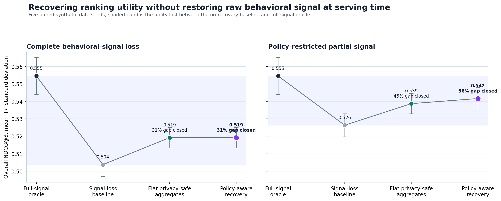
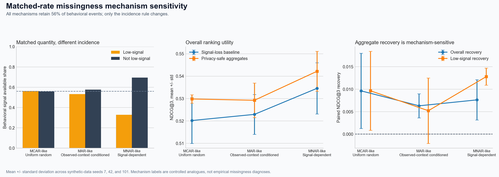

# FairPrivacySignal

[](https://doi.org/10.5281/zenodo.20130952)
[](https://github.com/AnthonyXu109/FairPrivacySignal/actions/workflows/benchmark-checks.yml)
[](LICENSE)

## In plain language

Computer systems in many fields rank options to offer people — which health program
to suggest, which course or support service, which local resource. To do this well,
they often rely on a person's past activity. New U.S. privacy rules increasingly
restrict that data. That protects people, but it also makes these systems less
accurate, and it tends to hurt the people and small organizations with the least
data to begin with.

**FairPrivacySignal is a free, public, open-source tool** showing how such a system
can stay useful *without* using restricted personal data — by rebuilding a
privacy-safe stand-in from information it is still allowed to use. It ships the
method, a test harness, and honest measurements.

**What it shows, in plain terms:** when the behavioral data is fully removed, the
method recovers roughly a *third* of the lost ranking quality; when some data
remains, it recovers *more than half*. These are results on controlled, synthetic
test data, reported with their limits — not a claim of real-world deployment.

**Why it matters beyond any one company:** the same problem recurs across U.S.
healthcare, education, public services, financial access, and online marketplaces.
Released openly rather than kept inside a single company, the method can be
inspected, reproduced, and reused by anyone working on it.

*Bottom line: a privacy-era capability that many U.S. sectors need, built in the open so the whole field — not a single employer — can inspect and use it.*

## Open, public, and independently verifiable

FairPrivacySignal is an independent, open-source project, public and non-proprietary by design: the full method, code, synthetic-data generator, and
results are MIT-licensed and permanently archived with a citable DOI
([10.5281/zenodo.20130952](https://doi.org/10.5281/zenodo.20130952)).
The repository is maintained by Chang Xu; the GitHub account `AnthonyXu109`
belongs to the same author.

No result has to be taken on trust. With no special access or data, anyone can
reproduce everything from a clean checkout:

```bash
git clone https://github.com/AnthonyXu109/FairPrivacySignal
cd FairPrivacySignal && bash scripts/verify_benchmark.sh
```

Using synthetic data is deliberate: it lets the entire method and its evaluation be
examined in public, with no personal, proprietary, or confidential data involved.
What the study does and does not claim is stated plainly in
[docs/limitations.md](docs/limitations.md); the U.S. public-interest context, with
sources, is in [docs/policy_context.md](docs/policy_context.md).

Behavioral signals often help ranking systems distinguish among otherwise similar
candidates. Those signals can become incomplete or unavailable when consent,
privacy, retention, or data-minimization rules change. Removing them protects
important boundaries, but it can also reduce ranking quality and affect the people
whose histories are least observable.

FairPrivacySignal is an open synthetic testbed and reference implementation for
recovering useful ranking information without returning unavailable event-level
behavior to the serving model. Its primary method, **Policy-Aware Signal
Recovery**, combines training-only cohort statistics with cross-fitted signal
reconstruction, then selects or fuses those substitutes according to the
availability policy.

The included experiments follow a public-service outreach example: households are
ranked for services under limited behavioral history. The same design can be
studied wherever a system ranks interventions, programs, providers, resources, or
opportunities using a mixture of contextual and restricted historical signals.

## Why this problem matters

Privacy-driven signal loss is not a single-company concern. It is an economy-wide
shift in how data-driven systems in the United States are allowed to operate:

- **Regulation is broad and growing.** Roughly twenty U.S. states have comprehensive
  consumer-privacy laws in effect as of 2026, each constraining how behavioral data is
  collected, retained, and used
  ([IAPP U.S. State Privacy Legislation Tracker](https://iapp.org/resources/article/us-state-privacy-legislation-tracker)).
- **The economic stakes are large.** After Apple's App Tracking Transparency moved
  mobile tracking to opt-in, an economic analysis hosted by the U.S. Federal Trade
  Commission reported that the trackable share of U.S. Apple traffic fell from 73% to
  18%, that trackable ad impressions carried 51% higher prices, and that the change
  implied a 21% fall in publisher ad revenue from Apple users. The same analysis
  estimated a U.S. monetary loss of about $15B and found that Meta's public $10B
  annual-loss estimate was directionally consistent with its calculation
  ([FTC-hosted economic analysis](https://www.ftc.gov/system/files/ftc_gov/pdf/3-Skiera-Economic-Impact-of-Opt-in-versus-Opt-out-Requirements-for-Personal-Data-Usage.pdf)).
- **Federal risk guidance expects it.** The NIST AI Risk Management Framework,
  referenced across U.S. federal agencies, treats data minimization and privacy as core
  components of trustworthy AI
  ([NIST AI RMF](https://www.nist.gov/itl/ai-risk-management-framework)).
- **It bears on U.S. AI competitiveness.** Keeping model quality and evaluation
  reliability stable as usable signal shrinks is part of keeping U.S. AI systems
  effective, a stated national priority
  ([2025 U.S. federal AI policy direction](https://www.whitehouse.gov/presidential-actions/2025/01/removing-barriers-to-american-leadership-in-artificial-intelligence/)).

FairPrivacySignal studies the core technical question these forces create: how can a
ranking or matching system stay useful, reliable, and stable when privacy rules remove
the individual-level signals it once relied on, without re-introducing restricted raw
data? The method and evaluation are released publicly, on synthetic data under an open
license, so the approach can be examined and reused across sectors rather than remaining
internal to any one company.

## At a glance


| Component | What the repository provides |
|---|---|
| Recovery method | Policy-conditioned substitution using privacy-safe aggregates and cross-fitted reconstruction |
| Evaluation task | Synthetic household-to-service ranking with complete and partial signal-loss regimes |
| Primary outcomes | Overall and low-signal NDCG@3, full-signal gap closed, and a comparative exposure proxy |
| Operational extension | Capacity-constrained allocation with explicit relevance and representation tradeoffs |
| Stress tests | Feature ablations, negative controls, missingness mechanisms, unseen communities, model classes, ranking objectives, and aggregate noise |
| Reproducibility | Five fixed synthetic-data seeds, generated reports and figures, regression tests, and one-command verification |

All event-level records are synthetic. No personal, proprietary, or confidential
data is used.

## Results



Across five paired synthetic-data seeds, Policy-Aware Signal Recovery improves
ranking quality in both evaluated availability regimes:

| Signal-loss regime | No recovery NDCG@3 | Policy-aware recovery NDCG@3 | Full-signal gap closed | Low-signal NDCG@3 change |
|---|---:|---:|---:|---:|
| Complete behavioral-signal loss | 0.504 | 0.519 | 31.4% | +0.015 |
| Policy-restricted partial signal | 0.526 | 0.542 | 56.1% | +0.016 |

The gains are positive in every paired seed. Under complete signal loss, the method
closes about one-third of the synthetic utility gap to the full-signal oracle. When
some observed values remain available, policy-conditioned fusion closes more than
half of that gap. The benchmark's comparative exposure score remains at the
matching signal-loss baseline; it tracks raw-feature availability and is not a
formal privacy guarantee.

These results do not imply that recovery can recreate the full-signal system.
Instead, they quantify how much useful ordering can be restored under explicit
information constraints. Full tables, standard deviations, and method-specific
comparisons are available in
[`docs/policy_aware_signal_recovery.md`](docs/policy_aware_signal_recovery.md).

## How the method works

Policy-Aware Signal Recovery separates offline estimation from online ranking.
The implementation has two recovery paths because complete and partial signal loss
present different estimation problems.

1. **Construct a training reference.** Historical engagement from training
   households is summarized into thresholded cohort statistics. Noise sensitivity
   and minimum-support rules are evaluated explicitly.
2. **Learn a contextual reconstruction.** A nonlinear model estimates the
   training-only behavioral signal from permitted context and candidate features.
3. **Cross-fit the training proxies.** Household-grouped folds ensure that each
   training record receives a reconstruction from a model that did not fit that
   record.
4. **Apply the availability policy.** Observed values are retained when allowed.
   Missing values receive a reconstructed proxy, an aggregate substitute, or a
   policy-conditioned fusion of both.
5. **Train and serve the ranker.** The downstream ranking model uses the permitted
   representation and never receives a hidden raw value for an unavailable event.


The reconstruction path assumes that historical signal may be used within a
controlled offline training process even when it cannot be exposed during serving.
Where offline use is also prohibited, the aggregate-only path is the relevant
configuration.

## What drives recovery

The feature ablation separates engagement aggregates from broader cohort-context
statistics. In the current synthetic configuration, the engagement aggregate
provides most of the measured improvement. Cohort context contributes a smaller
increment and is not consistently useful on its own.


This matters for implementation: adding more aggregate features is not
automatically beneficial. The benchmark requires each substitute group to justify
its contribution against the same-seed, no-aggregate baseline. Detailed values are
reported in
[`docs/recovery_feature_ablation.md`](docs/recovery_feature_ablation.md).

## Does the aggregate structure matter?

A useful substitute should help because it preserves relevant structure, not
merely because another numeric feature was added. The negative control keeps the
train-only aggregate construction intact while permuting service categories,
breaking the relationship between the aggregate and the service being ranked.


Under severe signal loss, mean overall recovery falls from `+0.0115` with aligned
aggregates to `-0.0014` after permutation. Under partial restriction it falls from
`+0.0102` to `+0.0009`. The low-signal result is less separated in the partial
regime, so the control is interpreted metric by metric rather than as a universal
effect.

See
[`docs/aggregate_alignment_negative_control.md`](docs/aggregate_alignment_negative_control.md)
for the protocol and complete table.

## Signal loss is not one condition

Two datasets can retain the same fraction of behavioral events while losing
information from very different records. FairPrivacySignal therefore evaluates
three matched-rate mechanisms: uniform-random loss, loss conditioned on observed
context, and loss conditioned on the signal that is later suppressed.



Every mechanism retains 56% of events overall. Low-signal availability nevertheless
ranges from 56.3% under uniform-random loss to 32.8% under signal-dependent loss.
The result shows why an aggregate availability rate is not enough to characterize
the difficulty or distributional effect of a privacy rule. The mechanism labels
are controlled synthetic analogues, not empirical missingness diagnoses.

Full results are in
[`docs/missingness_mechanism_sensitivity.md`](docs/missingness_mechanism_sensitivity.md).

## Robustness under unseen contexts

The primary protocol holds out households. A stricter stress test holds out entire
synthetic communities so that training and evaluation contexts are disjoint.
Recovery remains positive in both signal-loss regimes, with broad service fallback
used for less than 1% of evaluated events on average.


This test checks the behavior of the recovery pipeline when local context changes;
it is not a claim of geographic or temporal validation. Additional shift analyses
cover held-out context combinations, model classes, and pairwise ranking:

- [`docs/community_holdout_robustness.md`](docs/community_holdout_robustness.md)
- [`docs/heldout_context_shift.md`](docs/heldout_context_shift.md)
- [`docs/model_sensitivity.md`](docs/model_sensitivity.md)
- [`docs/pairwise_ranking_sensitivity.md`](docs/pairwise_ranking_sensitivity.md)

## From rankings to limited capacity

Many ranking systems feed a constrained decision: a clinic has a finite number of
appointments, a public program has limited outreach staff, a school has a limited
number of advising slots, or a financial-access program can review only a subset
of eligible applications. In these settings, improved scores do not determine the
allocation policy by themselves.

FairPrivacySignal converts ranked candidates into per-service allocations and
sweeps two operational choices:

- capacity rates from 5% to 30%
- low-signal allocation-floor strengths from 0% to 100%


The left panel traces allocated relevance against the share of selected low-signal
candidates. The heatmaps show how stronger allocation floors reduce selection-rate
gaps while changing the relevance of allocated slots. No point is labeled as
universally optimal; the purpose of the sweep is to make the policy tradeoff
visible before a threshold is chosen.

The complete allocation design and single-seed diagnostic figures are documented
in [`docs/capacity_allocation.md`](docs/capacity_allocation.md).

## Benchmark coverage

The main benchmark combines recovery quality, subgroup diagnostics, privacy
exposure, and constrained allocation rather than reducing evaluation to a single
accuracy number.


| Evaluation question | Included diagnostic |
|---|---|
| Does the method improve ranking after signal loss? | Paired five-seed overall and low-signal NDCG@3 |
| Which substitutes provide the gain? | Recovery feature ablation |
| Does semantic alignment matter? | Service-permuted aggregate negative control |
| Does the incidence of missingness matter? | Matched-rate mechanism sensitivity |
| Does recovery survive stricter separation? | Community holdout and held-out context shift |
| Is the result tied to one estimator? | Model-class and ranking-objective sensitivity |
| How fragile are the aggregates? | Noise-scale and cohort-threshold sweeps |
| What happens after ranking? | Capacity and allocation-floor frontiers |
| Are subgroup effects visible? | Low-signal ranking gaps, uncertainty audit, and allocation representation |

Supporting reports include:

- [aggregate noise sensitivity](docs/aggregate_noise_sensitivity.md)
- [cohort threshold sensitivity](docs/cohort_threshold_sensitivity.md)
- [disparate uncertainty audit](docs/disparate_uncertainty_audit.md)
- [education student performance public-data validation](docs/education_student_performance_validation.md)
- [finance German Credit public-data validation](docs/finance_german_credit_validation.md)
- [low-signal fairness metrics](docs/fairness_metrics.md)
- [MovieLens marketplace public-data validation](docs/movielens_marketplace_validation.md)
- [public reference calibration](docs/public_reference_calibration.md)
- [sector adaptation roadmap](docs/sector_adaptation.md)
- [underserved recovery profile](docs/underserved_recovery_profile.md)

The generated [benchmark card](docs/benchmark_card.md) summarizes the evaluated
scenarios and evidence. The [validation report](docs/validation_report.md) records
the checks enforced by the reproducibility pipeline.

## Where this pattern appears

The repository uses neutral entities and synthetic data so that the method can be
examined independently of a specific application dataset.

| Setting | Ranked candidate | Historical signal that may be restricted | Examples of permitted context |
|---|---|---|---|
| Healthcare outreach | Appointment, screening, or care-navigation option | Prior response or service-use history | Eligibility, distance, scheduling, and program attributes |
| Education | Course, advising resource, or support program | Prior participation or interaction history | Curriculum, location, availability, and consented student context |
| Public and nonprofit services | Benefit, outreach program, or local resource | Historical engagement with services | Program rules, geography, capacity, and community context |
| Financial access | Eligible product, assistance program, or review pathway | Prior digital interaction or response history | Product terms, eligibility, risk controls, and consented application data |
| Marketplaces | Provider, listing, or local opportunity | Click, contact, or transaction history | Item, provider, location, price, and availability attributes |

These examples describe a common system shape, not validated deployments. Applying
the method to any domain requires a domain-specific policy review, outcome
definition, subgroup analysis, and evaluation against locally appropriate
baselines. The [sector adaptation roadmap](docs/sector_adaptation.md) lays out
public-data pilots that could test the same signal-loss and recovery pattern in
healthcare, education, public services, financial access, and marketplaces without
using confidential data.

Three external public-data pilots are now included:
[MovieLens marketplace validation](docs/movielens_marketplace_validation.md)
tests held-out movie ranking after user-history signal loss, and
[education student performance validation](docs/education_student_performance_validation.md)
tests student-support ranking after prior-grade signal loss, and
[finance German Credit validation](docs/finance_german_credit_validation.md)
tests credit-application review ranking after financial-history signal loss.
Together they show the same signal-loss and privacy-preserving recovery pattern
outside the repository's synthetic benchmark.

## Reproduce the benchmark

FairPrivacySignal is designed to run on an ordinary laptop with NumPy, pandas,
scikit-learn, and Matplotlib.

```bash
python -m venv .venv
source .venv/bin/activate
python -m pip install --upgrade pip setuptools wheel
python -m pip install -r requirements.txt
bash scripts/verify_benchmark.sh
```

The verification command runs regression tests, compilation checks, the complete
benchmark pipeline, figure generation, and required methodological validations.
Generated tables, reports, and figures are deterministic for the fixed seeds.

Useful entry points:

| Path | Purpose |
|---|---|
| [`fairprivacysignal/`](fairprivacysignal/) | Data generation, policies, recovery methods, ranking, evaluation, and plotting |
| [`scripts/verify_benchmark.sh`](scripts/verify_benchmark.sh) | End-to-end verification |
| [`docs/benchmark_design.md`](docs/benchmark_design.md) | Task definition, controls, and evaluation protocol |
| [`docs/experiment_matrix.md`](docs/experiment_matrix.md) | Scenario and sensitivity coverage |
| [`docs/education_student_performance_validation.md`](docs/education_student_performance_validation.md) | Public education support validation |
| [`docs/finance_german_credit_validation.md`](docs/finance_german_credit_validation.md) | Public financial-access validation |
| [`docs/movielens_marketplace_validation.md`](docs/movielens_marketplace_validation.md) | Public MovieLens marketplace validation |
| [`docs/sector_adaptation.md`](docs/sector_adaptation.md) | Public-data roadmap for cross-sector validation |
| [`docs/reproducibility.md`](docs/reproducibility.md) | Runtime guidance and generated output locations |
| [`tests/`](tests/) | Regression and validation tests |

## Interpretation and limits

FairPrivacySignal is a methodological contribution: a public, reusable, and fully reproducible way to study privacy-driven signal loss and recovery on synthetic data. Running on synthetic data is a deliberate design choice, because it lets the method and its evaluation be inspected and reused publicly with no personal or proprietary data. Accordingly, the numbers here characterize how the method behaves under controlled, explicitly stated conditions; they are scoped to this benchmark and are not presented as the effect size a specific production deployment would observe. The comparative exposure score is a diagnostic proxy, not a formal privacy guarantee, and the implementation does not provide differential privacy or evaluate model-extraction risk. These are scope conditions for a public benchmark, not statements about the importance of the underlying problem, whose documented U.S. scale is summarized in [Why this problem matters](#why-this-problem-matters).

The project reports these limitations alongside the results so that utility gains
can be reviewed together with the assumptions that produce them:

- [`docs/limitations.md`](docs/limitations.md)
- [`docs/privacy_design.md`](docs/privacy_design.md)
- [`docs/policy_rules.md`](docs/policy_rules.md)
- [`docs/non_confidentiality_statement.md`](docs/non_confidentiality_statement.md)

## Related work

The design draws on public research in learning with privileged information,
learning-to-rank with unavailable serving features, missing-data mechanisms,
privacy-aware aggregation, distribution-shift evaluation, and fairness diagnostics.
[`docs/related_work.md`](docs/related_work.md) describes those connections and
separates the repository's method and evaluation choices from prior work.

FairPrivacySignal does not claim a new state-of-the-art ranking algorithm. Its
contribution is an inspectable recovery workflow, a set of controls for testing
why recovery occurs, and an evaluation path from ranking quality to constrained
allocation.

## Citation

FairPrivacySignal v0.1.1 is archived on Zenodo:
[10.5281/zenodo.20130952](https://doi.org/10.5281/zenodo.20130952).

Citation metadata is available in [`CITATION.cff`](CITATION.cff). The repository is
released under the [`MIT License`](LICENSE).
