# FairPrivacySignal

FairPrivacySignal is a public, non-confidential synthetic-data benchmark for studying privacy-preserving and fairness-aware AI ranking and matching systems under signal loss.

Many AI systems rely on user-level behavioral signals to decide which services, resources, or recommendations should be shown to people or communities. Privacy requirements, consent restrictions, data minimization rules, and reduced access to tracking signals can remove or weaken those signals. While these protections are important, signal loss can also reduce model utility and may disproportionately affect small, low-signal, or underserved participants.

This project demonstrates a reproducible public-service outreach scenario: matching communities or households to relevant public services such as preventive health outreach, food assistance, housing support, job training, and education resources.

The same technical pattern can apply to public agencies, healthcare outreach, nonprofit service delivery, education programs, local marketplaces, and small-business discovery systems.

## What this project demonstrates

- Synthetic public-service ranking and matching data generation
- Privacy-driven signal-loss simulation
- Consent-aware and policy-aware feature suppression
- Readable policy-rule configuration with validation
- Cohort aggregation and k-thresholding
- Train-fitted aggregate preprocessing for holdout evaluation
- Differential-privacy-style noise for aggregate features
- Aggregate-noise sensitivity analysis across reproducible perturbations
- Cohort-threshold sensitivity analysis for aggregate fallback coverage
- Recovery feature ablation with paired multi-seed comparisons
- Aggregate-alignment negative control with service-permuted references
- Lightweight model-class sensitivity diagnostic
- Pointwise, pairwise, and listwise ranking-objective sensitivity diagnostic
- Controlled heldout context-shift stress test
- Underserved quartile recovery profile with paired multi-seed comparisons
- Community-held-out robustness diagnostic with paired multi-seed comparisons
- Contextual and geography-level signals
- Utility metrics such as AUC and NDCG@K
- Fairness metrics for low-signal or underserved participants
- Fairness-aware recovery variants for low-signal ranking diagnostics
- Score-matched subgroup calibration diagnostics
- Public-reference calibration diagnostic with a tracked Census Bureau snapshot
- Capacity-constrained allocation under limited outreach slots
- Multi-seed allocation sensitivity analysis
- Privacy exposure scoring
- Multi-seed reproducibility checks

## Data and confidentiality

This project uses synthetic data and public aggregate references only. It does not use real personal data, private datasets, proprietary systems, internal business metrics, or confidential implementation details from any organization.

This repository is an educational and research-oriented synthetic benchmark.

## Intended use

FairPrivacySignal is intended to illustrate engineering patterns for evaluating privacy, utility, and fairness tradeoffs in AI ranking and matching systems. It is not a production privacy system and does not provide formal privacy guarantees unless explicitly stated.

## Reproduce the benchmark

FairPrivacySignal includes a one-command benchmark pipeline. From a clean checkout:

    python -m venv .venv
    source .venv/bin/activate
    python -m pip install --upgrade pip setuptools wheel
    python -m pip install -r requirements.txt
    bash scripts/run_benchmark.sh

The full reproducibility guide is available in [`docs/reproducibility.md`](docs/reproducibility.md).

To run the regression tests, compilation check, full benchmark pipeline, and final
validation gate together:

    bash scripts/verify_benchmark.sh

The repository workflow in
[`benchmark-checks.yml`](.github/workflows/benchmark-checks.yml) runs the same
verification sequence for pull requests and `main` updates.

## Benchmark methodology

For a detailed explanation of the benchmark design, assumptions, signal-loss scenarios, privacy-safe recovery layer, metrics, and limitations, see [`docs/benchmark_design.md`](docs/benchmark_design.md).

The current and planned experiment matrix is summarized in [`docs/experiment_matrix.md`](docs/experiment_matrix.md).

The public research directions that inform the benchmark are summarized in [`docs/related_work.md`](docs/related_work.md).

The auditable signal-suppression configuration is documented in [`docs/policy_rules.md`](docs/policy_rules.md).

The pipeline also writes a machine-checked [`benchmark validation report`](docs/validation_report.md).

For a compact reviewer-facing index of experimental scale, coverage, key results,
sensitivity checkpoints, and evidence links, see the generated
[`benchmark card`](docs/benchmark_card.md).

The selected synthetic context priors are compared with a tracked public-reference
snapshot in [`docs/public_reference_calibration.md`](docs/public_reference_calibration.md).

## Contributing

Focused contributions that improve reproducibility, validation, sensitivity
analysis, documentation, or figure clarity are welcome. See
[`CONTRIBUTING.md`](CONTRIBUTING.md) for the verification workflow, data
boundaries, and guidance for proposing benchmark extensions.

## Benchmark system map

FairPrivacySignal is organized as a reproducible benchmark system rather than a
single model demo. The map connects the synthetic foundation, privacy and recovery
mechanisms, ranking and allocation paths, reviewer-facing evidence surfaces, and
the machine-checked validation gate.

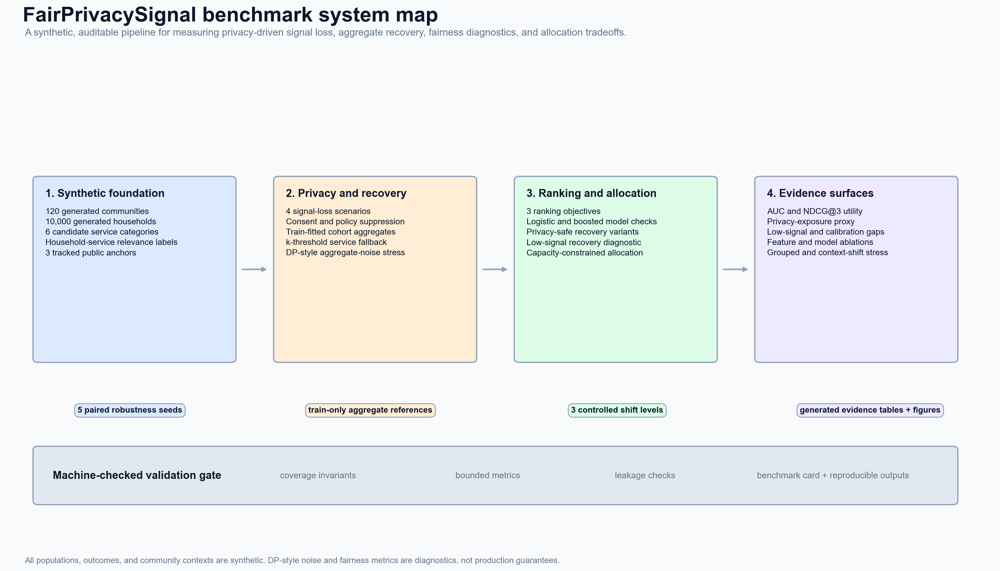

## Results

FairPrivacySignal demonstrates a privacy-utility-fairness tradeoff in a synthetic public-service outreach setting. The benchmark shows that low-signal households are more concentrated in underserved communities, signal loss can reduce ranking utility, and privacy-safe aggregate/contextual features can partially recover utility while keeping individual behavioral exposure reduced.

Aggregate recovery metrics use training-household cohort statistics and service-level
fallbacks. Holdout households receive the learned mapping without contributing to
its construction.

### Benchmark at a glance

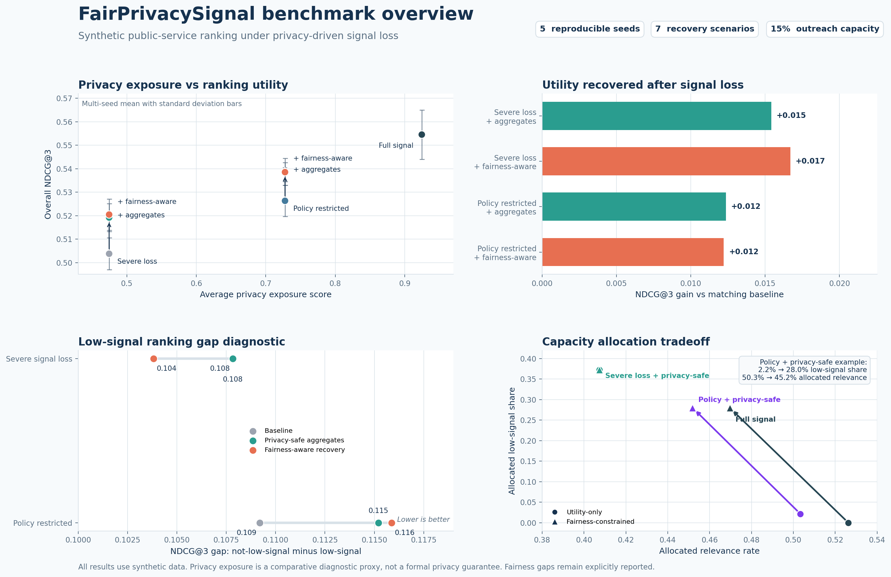

This overview combines multi-seed recovery results with the capacity-constrained allocation experiment. It shows utility recovery after signal loss, the remaining low-signal ranking gaps, and the explicit tradeoff between allocated relevance and low-signal representation when outreach opportunities are limited.

### 1. Low-signal households concentrate in underserved communities

### 2. Selected synthetic priors are explicit and inspectable

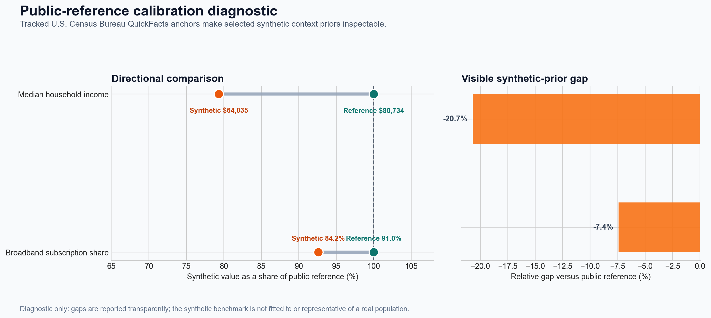

The benchmark compares selected synthetic context priors with a tracked U.S. Census
Bureau snapshot. The visible gaps are intentional: this is a directional
diagnostic, not an automatic fit or a claim that the synthetic benchmark represents
a real population. See [`docs/public_reference_calibration.md`](docs/public_reference_calibration.md).

### 3. Privacy-safe aggregate features partially recover ranking utility

### 4. Aggregate recovery remains inspectable across noise strengths

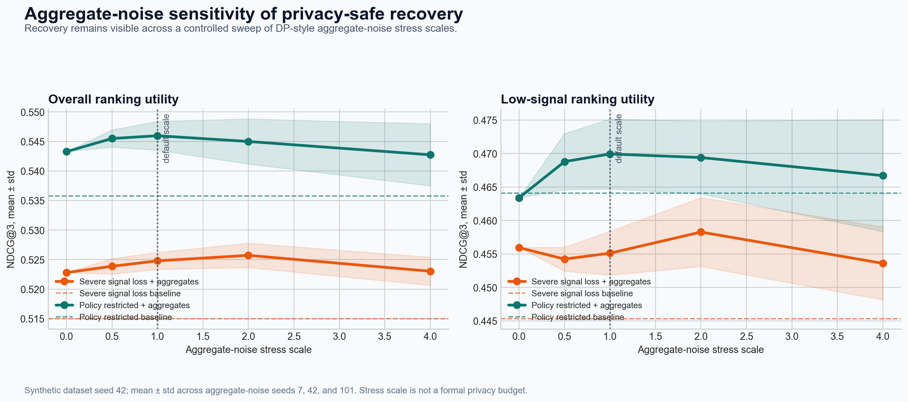

The benchmark varies the DP-style aggregate-noise stress scale and repeats each
setting across three reproducible noise realizations. This exposes whether the
recovery result depends on one favorable perturbation or parameter point. The sweep
is a stress diagnostic, not a formal privacy-budget analysis. See
[`docs/aggregate_noise_sensitivity.md`](docs/aggregate_noise_sensitivity.md).

### 5. Feature ablation separates recovery components

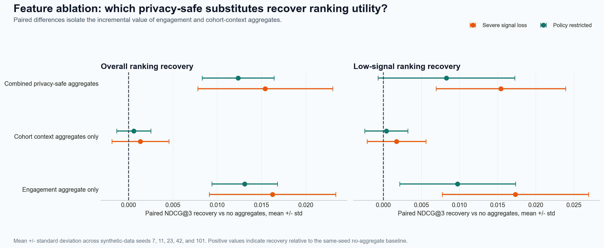

The paired five-seed ablation shows that the engagement aggregate provides most of
the observed ranking recovery in this synthetic configuration. Cohort-context
aggregates contribute less when used alone, while their combined use adds a modest
increment under severe signal loss. See
[`docs/recovery_feature_ablation.md`](docs/recovery_feature_ablation.md).

### 6. Recovery depends on semantically aligned aggregate structure

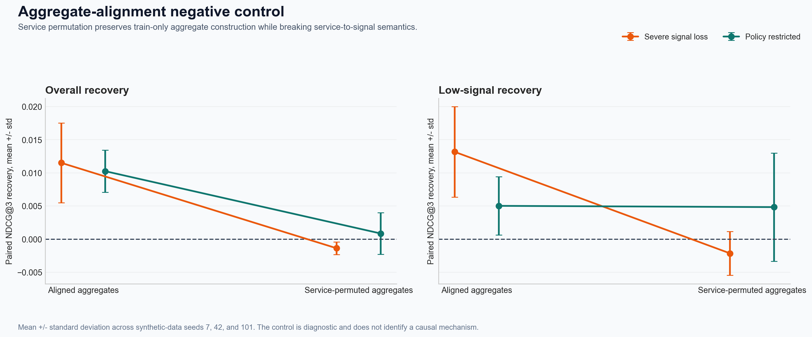

This structural negative control preserves train-only aggregate construction but
cyclically permutes service categories in the reference data before feature
generation. Under severe signal loss, mean overall NDCG@3 recovery changes from
`+0.0115` with aligned aggregates to `-0.0014` after permutation. Under the
policy-restricted scenario it changes from `+0.0102` to `+0.0009`. The
policy-restricted low-signal comparison is less separated, so this diagnostic is
interpreted metric by metric rather than as a uniform effect. See
[`docs/aggregate_alignment_negative_control.md`](docs/aggregate_alignment_negative_control.md).

### 7. Recovery effects remain model-dependent

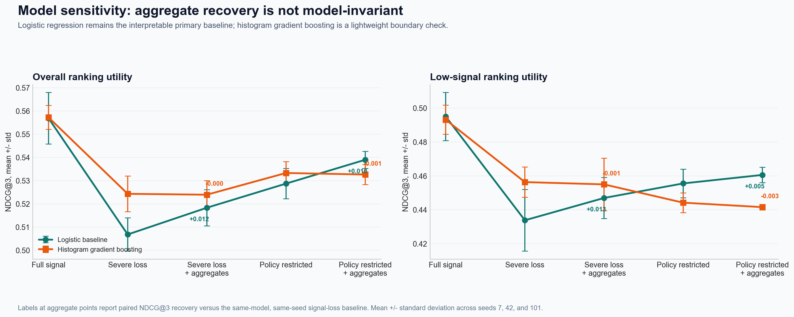

The benchmark compares its interpretable logistic primary baseline with a
lightweight histogram gradient boosting model. Aggregate recovery is clear for the
logistic baseline, but smaller or absent for the non-linear comparison model. This
keeps the claim bounded: recovery depends on the model and scenario rather than
holding automatically. See [`docs/model_sensitivity.md`](docs/model_sensitivity.md).

### 8. Aggregate recovery remains visible across ranking objectives

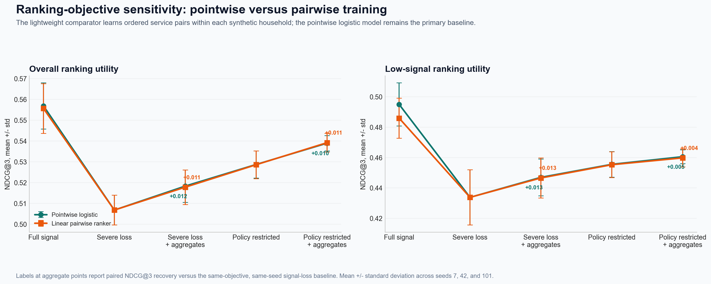

The benchmark compares its pointwise logistic primary baseline with a lightweight
linear pairwise ranker trained on ordered service pairs and a lightweight linear
listwise ranker trained on complete candidate-service lists within each synthetic
household. Aggregate recovery is reported separately for each objective across
three paired seeds. Under severe signal loss, mean overall NDCG@3 recovery is
`+0.0115` for pointwise training, `+0.0110` for pairwise training, and `+0.0115`
for listwise training. This is a ranking-objective sensitivity check, not a claim
that one comparator is universally stronger. See
[`docs/pairwise_ranking_sensitivity.md`](docs/pairwise_ranking_sensitivity.md).

### 9. Pooled gains can hide quartile-specific regressions

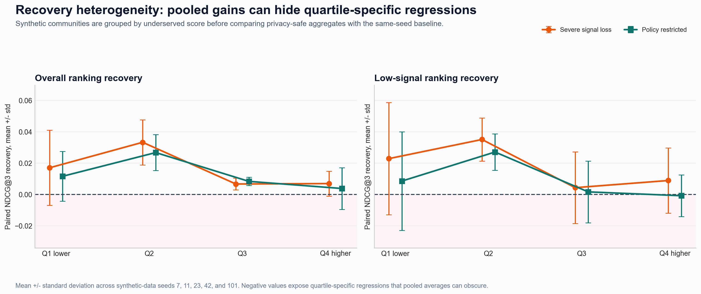

The paired five-seed profile groups distinct synthetic communities by underserved
score before measuring aggregate-minus-baseline recovery. Pooled recovery does not
imply uniform benefit: low-signal recovery varies across quartiles and can be
negative in some contexts. See
[`docs/underserved_recovery_profile.md`](docs/underserved_recovery_profile.md).

### 10. Recovery remains visible under a community-held-out stress test

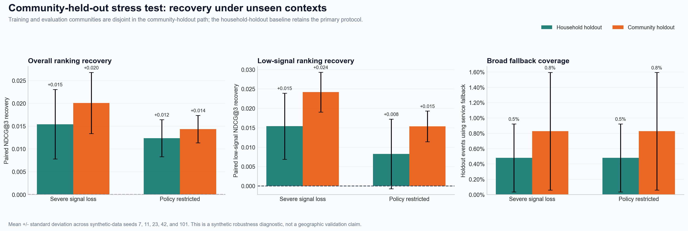

The primary benchmark uses a household-level holdout. This additional paired
diagnostic makes the split stricter by keeping training and evaluation communities
disjoint. Aggregate recovery remains positive in the current synthetic
configuration: under severe signal loss, mean overall NDCG@3 recovery is `+0.020`
for community holdout versus `+0.015` for household holdout. This is a synthetic
robustness stress test, not a geographic validation claim. See
[`docs/community_holdout_robustness.md`](docs/community_holdout_robustness.md).

### 11. Controlled context drift exposes another holdout failure mode

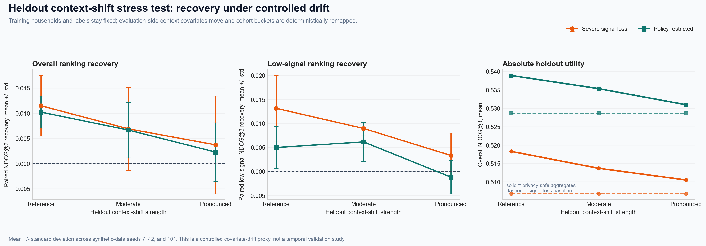

This paired stress test keeps training households, labels, and service candidates
fixed while moving seven synthetic context covariates and remapping a deterministic
share of holdout context buckets on the evaluation side. Privacy-safe aggregates
continue to use training-household reference statistics only. The result is a
controlled covariate-drift proxy: it makes recovery curves inspectable under a
distribution-shift stress without presenting synthetic results as temporal or
deployment validation. In this configuration, severe-loss overall recovery falls
from `+0.0115` at the reference holdout to `+0.0037` under pronounced shift, while
policy-restricted low-signal recovery falls from `+0.0050` to `-0.0011`. See
[`docs/heldout_context_shift.md`](docs/heldout_context_shift.md).

### 12. Privacy-utility tradeoff across signal-loss scenarios

### 13. Higher cohort thresholds expose the fallback-utility tradeoff

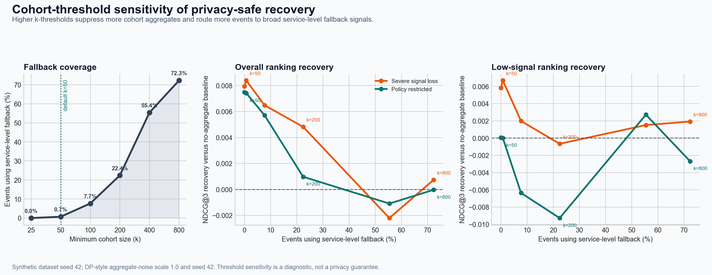

The benchmark sweeps the minimum cohort size required before a cohort aggregate can
be used. As the threshold increases, more events use broad service-level fallback
signals. The diagnostic reports how overall and low-signal recovery change along
that path. See
[`docs/cohort_threshold_sensitivity.md`](docs/cohort_threshold_sensitivity.md).

## Multi-seed benchmark results

To make the benchmark more robust, FairPrivacySignal evaluates the privacy-recovery experiment across five synthetic data seeds. Each run also uses the corresponding seed for DP-style aggregate noise, so both the synthetic population and privacy-safe recovery layer vary reproducibly.

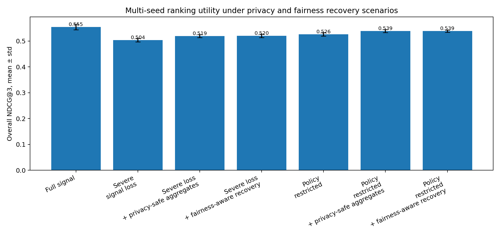

The multi-seed results show that severe signal loss consistently reduces ranking utility, while privacy-safe aggregate and contextual features partially recover NDCG@3 under both severe signal-loss and policy-restricted scenarios. The fairness-aware variants have mixed effects: the low-signal gap narrows modestly under severe signal loss but does not improve under policy restriction.

| Scenario | Privacy exposure | NDCG@3 | Low-signal NDCG@3 | Low-signal gap |
|---|---:|---:|---:|---:|
| Full signal raw baseline | 0.925 ± 0.002 | 0.555 ± 0.011 | 0.490 ± 0.014 | 0.095 ± 0.009 |
| Severe signal loss | 0.475 ± 0.002 | 0.504 ± 0.007 | 0.430 ± 0.014 | 0.108 ± 0.018 |
| Severe loss + privacy-safe aggregates | 0.475 ± 0.002 | 0.519 ± 0.006 | 0.445 ± 0.012 | 0.108 ± 0.015 |
| Severe loss + fairness-aware recovery | 0.475 ± 0.002 | 0.520 ± 0.007 | 0.449 ± 0.013 | 0.104 ± 0.013 |
| Policy restricted | 0.728 ± 0.007 | 0.526 ± 0.007 | 0.451 ± 0.008 | 0.109 ± 0.010 |
| Policy restricted + privacy-safe aggregates | 0.728 ± 0.007 | 0.539 ± 0.006 | 0.460 ± 0.008 | 0.115 ± 0.007 |
| Policy restricted + fairness-aware recovery | 0.728 ± 0.007 | 0.539 ± 0.004 | 0.459 ± 0.003 | 0.116 ± 0.005 |

These results support the project’s utility-recovery claim. The fairness gap remains explicitly reported as a diagnostic rather than presented as solved.

## Fairness diagnostics

FairPrivacySignal also tracks low-signal ranking gaps to ensure that utility recovery does not hide unequal effects on low-signal or underserved populations. This diagnostic is intentionally reported separately from the utility-recovery claim.

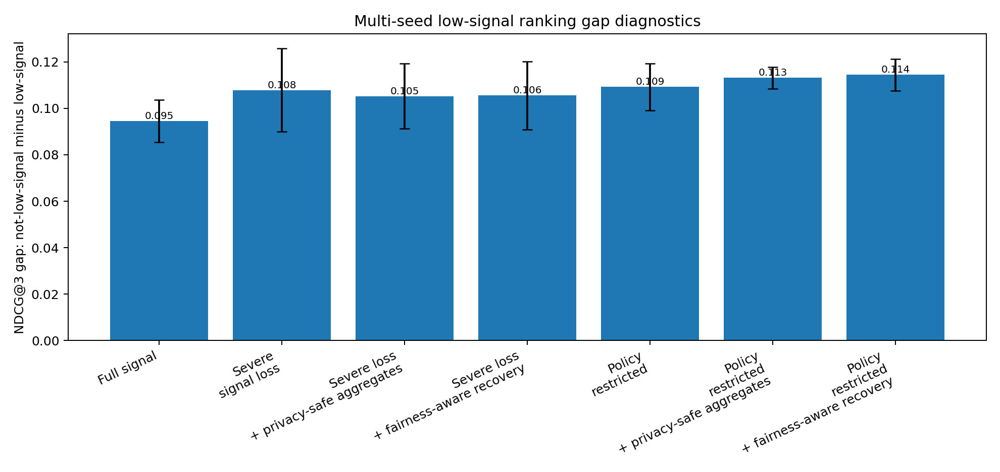

### Score-matched subgroup calibration

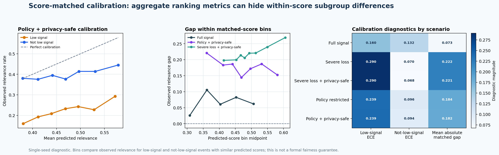

Aggregate metrics can conceal differences among similarly scored candidates. This diagnostic places test-set events into shared predicted-score bins and compares observed relevance for low-signal and not-low-signal groups within those bins. It is a lightweight, seed-42 diagnostic rather than a formal fairness guarantee. See [`docs/fairness_metrics.md`](docs/fairness_metrics.md) for definitions and limitations.

## Capacity-constrained allocation

Ranking quality is only part of the problem when outreach slots, appointment capacity, staff time, or funding are limited. FairPrivacySignal includes a capacity-constrained allocation experiment that compares utility-only allocation with a fairness-constrained policy that reserves a minimum share of outreach capacity for low-signal households.

The allocation experiment makes the utility-fairness tradeoff visible rather than assuming one objective automatically improves the other. See [`docs/capacity_allocation.md`](docs/capacity_allocation.md) for the full setup, metrics, and figures.

### Capacity sensitivity frontier

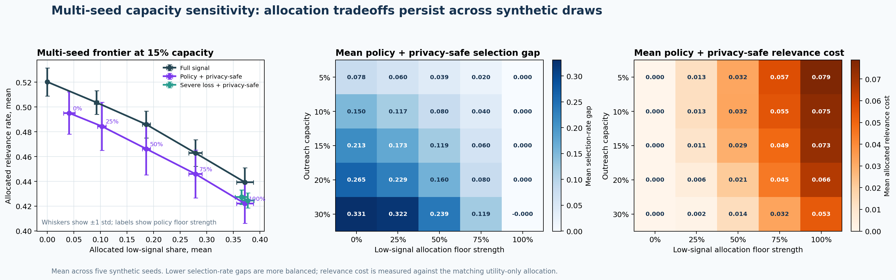

The sensitivity analysis sweeps multiple outreach-capacity levels and low-signal allocation-floor strengths across five synthetic seeds. The frontier and heatmaps show that a fairness constraint should be evaluated as a policy choice with measurable tradeoffs, not as a single fixed switch. The single-seed supporting figure remains available in [`docs/capacity_allocation.md`](docs/capacity_allocation.md).

## Notes on synthetic data

All results are based on synthetic data. The benchmark is designed to illustrate engineering patterns for evaluating privacy, utility, and fairness tradeoffs; it is not intended to model any real community or provide production-grade privacy guarantees.

## Archived release

FairPrivacySignal v0.1.1 has been archived on Zenodo with DOI: [10.5281/zenodo.20130952](https://doi.org/10.5281/zenodo.20130952).

Citation metadata is available in [`CITATION.cff`](CITATION.cff). The repository is
released under the [`MIT License`](LICENSE).
