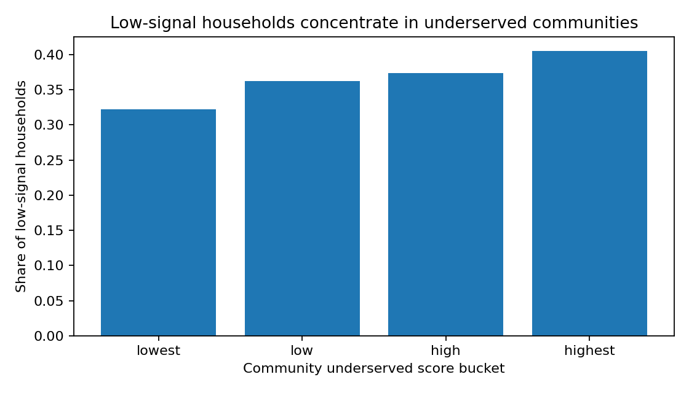
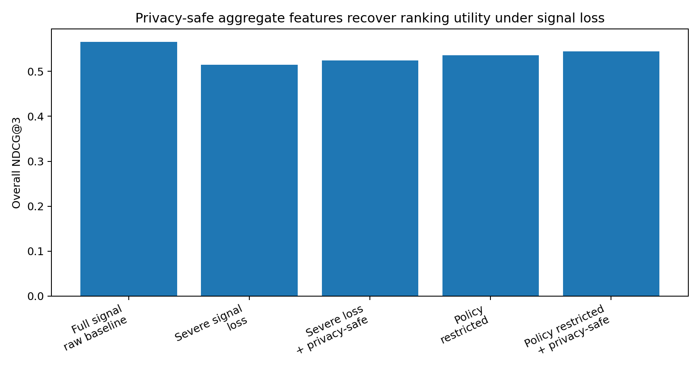
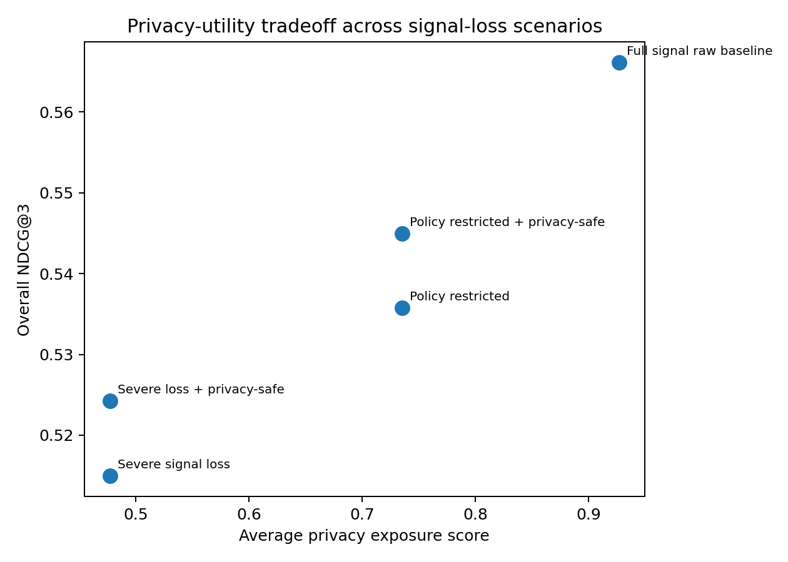
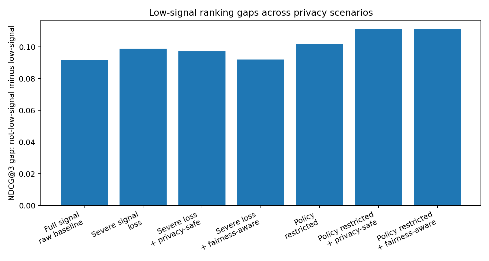

# FairPrivacySignal

FairPrivacySignal is a public, non-confidential synthetic-data benchmark for studying privacy-preserving and fairness-aware AI ranking and matching systems under signal loss.

Many AI systems rely on user-level behavioral signals to decide which services, resources, or recommendations should be shown to people or communities. Privacy requirements, consent restrictions, data minimization rules, and reduced access to tracking signals can remove or weaken those signals. While these protections are important, signal loss can also reduce model utility and may disproportionately affect small, low-signal, or underserved participants.

This project demonstrates a simple, reproducible public-service outreach scenario: matching communities or households to relevant public services such as preventive health outreach, food assistance, housing support, job training, and education resources. The project uses synthetic data, optionally calibrated with public aggregate datasets, to show how privacy-preserving transformations and fairness-aware evaluation can reduce reliance on raw personal data while preserving useful ranking performance.

The same technical pattern can apply to public agencies, healthcare outreach, nonprofit service delivery, education programs, local marketplaces, and small-business discovery systems.

## What this project demonstrates

- Synthetic public-service ranking and matching data generation
- Privacy-driven signal loss simulation
- Consent-aware and policy-aware feature suppression
- Cohort aggregation and k-thresholding
- Differential-privacy-style noise for aggregate features
- Contextual and geography-level signals
- Utility metrics such as AUC and NDCG@K
- Fairness metrics for low-signal or underserved participants
- Privacy exposure scoring
- Reproducible notebooks and visualizations

## Data and confidentiality

This project uses synthetic data and public aggregate references only. It does not use real personal data, private datasets, proprietary systems, internal business metrics, or confidential implementation details from any organization.

This repository is an educational and research-oriented synthetic benchmark.

## Intended use

FairPrivacySignal is intended to illustrate engineering patterns for evaluating privacy, utility, and fairness tradeoffs in AI ranking and matching systems. It is not a production privacy system and does not provide formal privacy guarantees unless explicitly state.

## Results

FairPrivacySignal demonstrates a privacy-utility-fairness tradeoff in a synthetic public-service outreach setting. The benchmark shows that low-signal households are more concentrated in underserved communities, signal loss can reduce ranking utility, and privacy-safe aggregate/contextual features can partially recover utility while keeping individual behavioral exposure reduced.

### 1. Low-signal households concentrate in underserved communities

### 2. Privacy-safe aggregate features partially recover ranking utility

### 3. Privacy-utility tradeoff across signal-loss scenarios

## Fairness diagnostics

FairPrivacySignal also tracks low-signal ranking gaps to ensure that utility recovery does not hide unequal effects on low-signal or underserved populations. This diagnostic is intentionally reported separately from the utility-recovery claim.

## Notes on synthetic data

All results are based on synthetic data. The benchmark is designed to illustrate engineering patterns for evaluating privacy, utility, and fairness tradeoffs; it is not intended to model any real community or provide production-grade privacy guarantees.

<!-- Zenodo archival trigger release. -->

## Archived release

FairPrivacySignal v0.1.1 has been archived on Zenodo with DOI: [10.5281/zenodo.20130952](https://doi.org/10.5281/zenodo.20130952).
