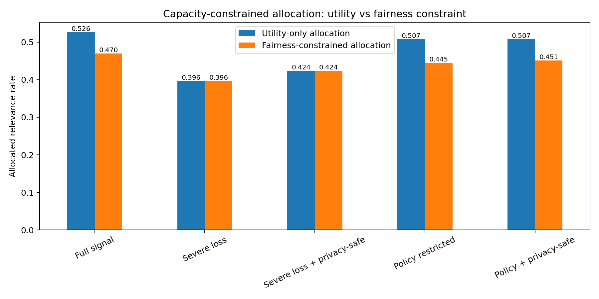
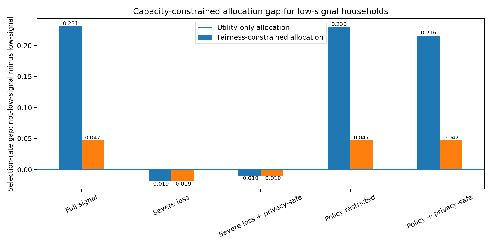
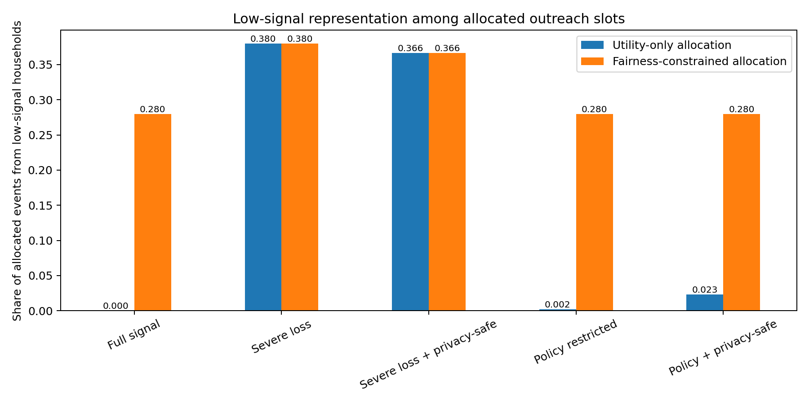

# Capacity-Constrained Allocation Experiment

FairPrivacySignal extends the ranking benchmark with a capacity-constrained allocation experiment.

In many public-service outreach settings, the system cannot contact or serve every candidate. A public agency, nonprofit, clinic, or education program may have limited staff time, outreach slots, appointment capacity, or funding. This makes the problem more complex than ranking alone: a system must decide which candidates receive limited outreach opportunities.

## Experiment Setup

The experiment uses the same synthetic household-service relevance data as the core benchmark. For each service category, only a fixed share of top-ranked household-service pairs can be allocated.

The current capacity rate is 15 percent per service category.

## Allocation Policies

The experiment compares two allocation policies.

| Policy | Description |
|---|---|
| Utility-only allocation | Selects the highest-scoring candidates for each service category. |
| Fairness-constrained allocation | Reserves a minimum share of allocation capacity for low-signal households, based on their candidate share. |

## Metrics

| Metric | Meaning |
|---|---|
| Allocated relevance rate | Share of allocated outreach slots that are truly relevant in the synthetic data. |
| Allocation relevance lift | Allocated relevance rate minus the overall candidate relevance rate. |
| Low-signal selection rate | Share of low-signal candidates selected for allocation. |
| Selection-rate gap | Difference between not-low-signal and low-signal selection rates. |
| Allocated low-signal share | Share of allocated slots going to low-signal households. |

## Interpretation

This experiment demonstrates a practical utility-fairness tradeoff.

Utility-only allocation can achieve high allocated relevance, but may under-select low-signal households when available signals favor better-observed candidates. Fairness-constrained allocation can substantially improve low-signal representation and reduce selection-rate gaps, but may reduce allocated relevance rate.

This is not presented as a solved fairness objective. Instead, it makes the tradeoff explicit and measurable.

## Current Single-Seed Result

In the current seed-42 experiment:

- Full-signal utility-only allocation reaches a high allocated relevance rate but selects no low-signal households.
- Fairness-constrained allocation increases low-signal representation and sharply reduces the selection-rate gap, but lowers allocated relevance rate.
- Privacy-safe aggregate recovery improves allocation quality under severe signal loss relative to severe signal-loss baseline.
- Under policy restriction, privacy-safe aggregate recovery preserves high allocation quality while slightly improving low-signal allocation compared with the policy-restricted utility-only baseline.

## Figures

### Allocation quality

### Low-signal selection-rate gap

### Low-signal representation among allocated slots

