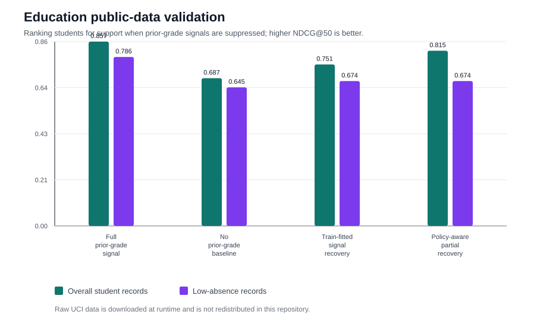

# Education Student Performance Validation

This public-data pilot adapts the FairPrivacySignal signal-loss pattern to an
education support setting using the UCI Student Performance dataset. Student-course
records are ranked for support need; prior period grades are treated as historical
academic signals that may be unavailable under privacy, retention, or consent limits.

The raw UCI files are downloaded at runtime and are not redistributed in this repository.

## Task

- **Ranked candidate:** student-course records for support triage
- **Restricted historical signal:** prior grades `G1` and `G2`
- **Permitted context:** school, subject, study time, absences, prior failures, and family context
- **Low-signal group:** students with below-median absences, where obvious administrative warning signals are weaker
- **Metric:** NDCG@50, with binary relevance defined as final grade `G3 < 10`

## Results

| method | overall_ndcg_at_50 | low_signal_ndcg_at_50 | full_signal_gap_closed | prior_grade_exposure |
| --- | --- | --- | --- | --- |
| Full prior-grade signal | 0.857 | 0.786 | 100.0% | 1.000 |
| No prior-grade baseline | 0.687 | 0.645 | 0.0% | 0.000 |
| Train-fitted signal recovery | 0.751 | 0.674 | 37.5% | 0.000 |
| Policy-aware partial recovery | 0.815 | 0.674 | 75.1% | 0.433 |

The train-fitted recovery path closes 37.5%
of the full-signal NDCG@50 gap without using individual prior-grade features at
scoring time. The policy-aware partial path keeps prior-grade signal for higher-signal
records and substitutes the recovered prior-grade risk for low-signal records, closing
75.1% of the same gap in this pilot.

## Interpretation

This is an external public-data validation of the system shape, not a school deployment.
It shows how the method can be instantiated in an education-support workflow: define a
restricted historical academic signal, suppress it at scoring time, substitute a
train-fitted reconstruction with a cohort stabilizer, and measure support-ranking
recovery. The dataset is small and does not contain a real privacy-policy event, so
the availability policy is simulated for evaluation.
