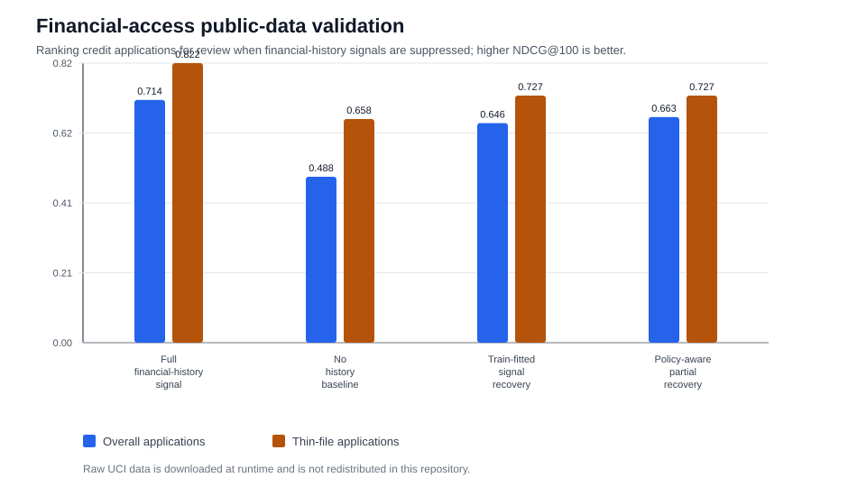
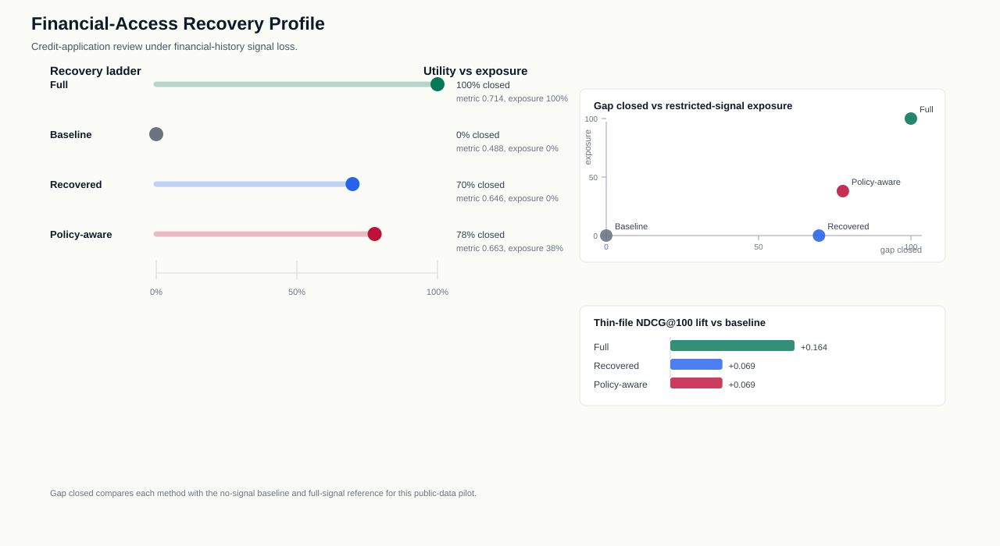

# Finance German Credit Validation

This public-data pilot adapts the FairPrivacySignal signal-loss pattern to a
financial-access review setting using the UCI German Credit dataset. Credit
applications are ranked for manual review or assistance; checking-account status,
credit-history status, and savings status are treated as historical financial
signals that may be unavailable or minimized under a privacy-preserving workflow.

The raw UCI file is downloaded at runtime and is not redistributed in this repository.

## Task

- **Ranked candidate:** credit applications for review triage
- **Restricted historical signal:** checking-account status, credit-history status, and savings status
- **Permitted context:** amount, duration, purpose, employment, housing, property, installment rate, age, and other application context
- **Low-signal group:** thin-file applications with one or fewer existing credits
- **Metric:** NDCG@100, with binary relevance defined as the dataset's higher-risk credit class

## Results

| method | overall_ndcg_at_100 | thin_file_ndcg_at_100 | full_signal_gap_closed | history_signal_exposure |
| --- | --- | --- | --- | --- |
| Full financial-history signal | 0.714 | 0.822 | 100.0% | 1.000 |
| No history baseline | 0.488 | 0.658 | 0.0% | 0.000 |
| Train-fitted signal recovery | 0.646 | 0.727 | 69.8% | 0.000 |
| Policy-aware partial recovery | 0.663 | 0.727 | 77.7% | 0.380 |

The train-fitted recovery path closes 69.8%
of the full-signal NDCG@100 gap without exposing the restricted financial-history
features at scoring time. The policy-aware partial path keeps those history
signals for non-thin-file applications while substituting recovered signal for
thin-file applications, closing 77.7%
of the same gap in this pilot.

## Interpretation

This is an external public-data validation of the system shape, not a credit
decisioning deployment. It shows how the method can be instantiated in a
financial-access workflow: define historical financial signals, suppress them at
scoring time, substitute a train-fitted reconstruction with a cohort stabilizer,
and measure review-ranking recovery. The dataset is old, compact, and does not
contain a real privacy-policy event, so the availability policy is simulated for
evaluation.
