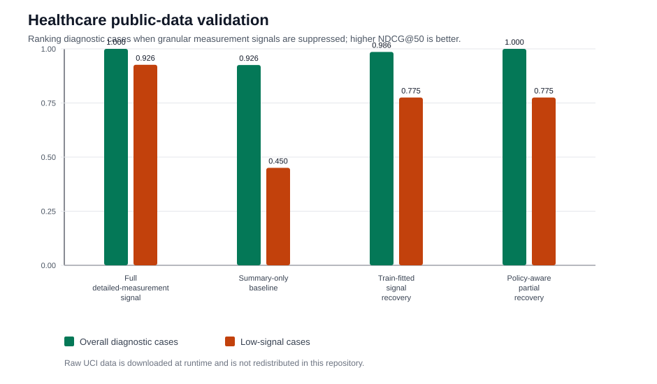
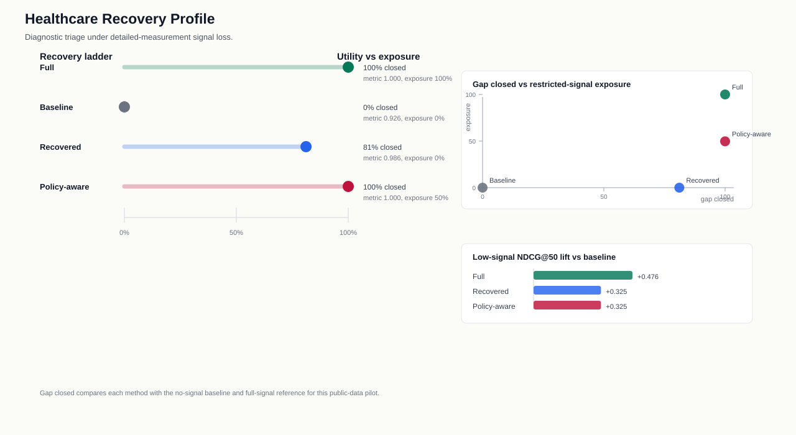

# Healthcare WDBC Validation

This public-data pilot adapts the FairPrivacySignal signal-loss pattern to a
healthcare diagnostic-triage setting using the UCI Wisconsin Diagnostic Breast
Cancer dataset. Diagnostic cases are ranked for review; granular "worst"
measurement features are treated as detailed clinical signals that may be
unavailable under a data-minimization workflow, while summary and standard-error
measurements remain available.

The raw UCI file is downloaded at runtime and is not redistributed in this repository.

## Task

- **Ranked candidate:** diagnostic cases for review triage
- **Restricted clinical signal:** granular `worst_*` diagnostic measurements
- **Permitted context:** `mean_*` and `se_*` measurement summaries
- **Low-signal group:** cases below the median permitted-context score
- **Metric:** NDCG@50, with binary relevance defined as malignant diagnosis

## Results

| method | overall_ndcg_at_50 | low_signal_ndcg_at_50 | full_signal_gap_closed | detail_signal_exposure |
| --- | --- | --- | --- | --- |
| Full detailed-measurement signal | 1.000 | 0.926 | 100.0% | 1.000 |
| Summary-only baseline | 0.926 | 0.450 | 0.0% | 0.000 |
| Train-fitted signal recovery | 0.986 | 0.775 | 81.1% | 0.000 |
| Policy-aware partial recovery | 1.000 | 0.775 | 100.0% | 0.497 |

The train-fitted recovery path closes 81.1%
of the full-signal NDCG@50 gap without exposing the restricted detailed
measurement features at scoring time. The policy-aware partial path keeps detailed
measurement signal for higher-signal cases while substituting recovered signal for
low-signal cases, closing 100.0%
of the same gap in this pilot.

## Interpretation

This is an external public-data validation of the system shape, not a diagnostic
deployment. It shows how the method can be instantiated in a healthcare workflow:
define a restricted clinical signal, suppress it at scoring time, substitute a
train-fitted reconstruction with a cohort stabilizer, and measure triage-ranking
recovery. The dataset is compact and does not contain a real privacy-policy event,
so the availability policy is simulated for evaluation.
