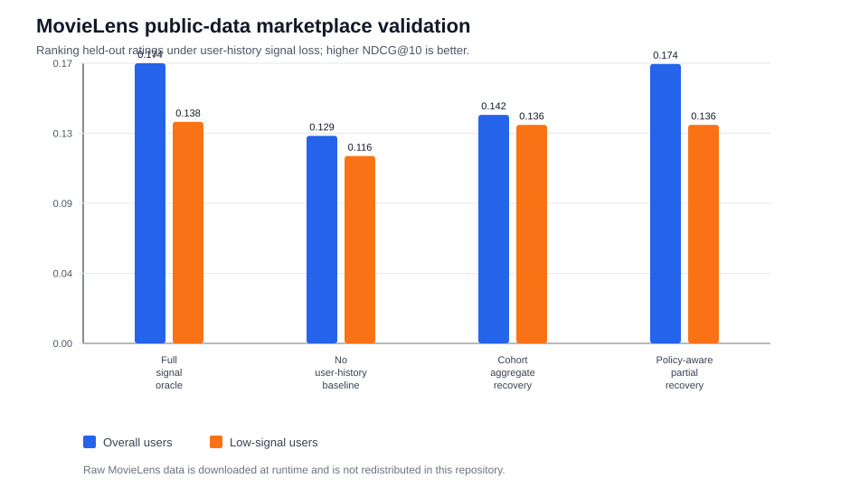
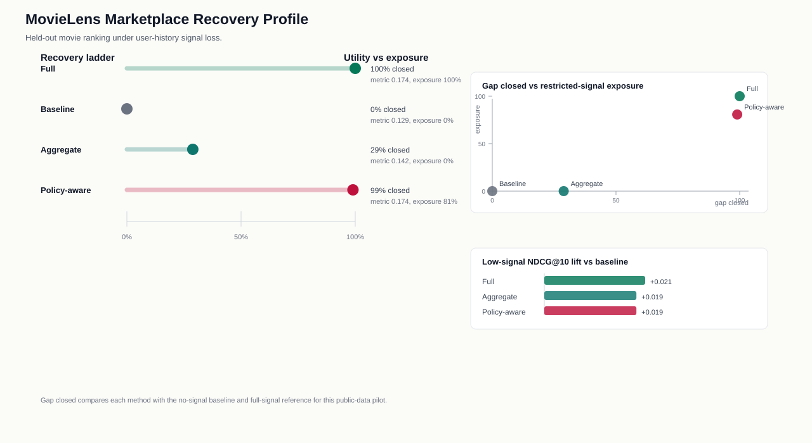

# MovieLens Marketplace Validation

This public-data pilot adapts the FairPrivacySignal signal-loss pattern to a
marketplace recommendation setting using MovieLens latest-small. Users rank held-out
movies against sampled unrated candidate movies; their prior rating history is treated
as the behavioral signal that may be unavailable under privacy, retention, or consent
constraints.

The raw MovieLens files are downloaded at runtime from GroupLens and are not
redistributed in this repository. The pilot uses only public ratings and movie genres.

## Task

- **Ranked candidate:** held-out rated movies plus sampled unrated candidate movies
- **Restricted historical signal:** user-specific genre preference inferred from prior ratings
- **Permitted context:** movie-level rating aggregates, movie popularity, and genre-level aggregates
- **Low-signal group:** users in the bottom quartile of training-history volume
- **Metric:** NDCG@10, with binary relevance defined as held-out rating >= 4

## Results

| method | overall_ndcg_at_10 | low_signal_ndcg_at_10 | full_signal_gap_closed | individual_history_exposure |
| --- | --- | --- | --- | --- |
| Full signal oracle | 0.174 | 0.138 | 100.0% | 1.000 |
| No user-history baseline | 0.129 | 0.116 | 0.0% | 0.000 |
| Cohort aggregate recovery | 0.142 | 0.136 | 28.9% | 0.000 |
| Policy-aware partial recovery | 0.174 | 0.136 | 99.0% | 0.807 |

The aggregate-only recovery path closes 28.9%
of the full-signal NDCG@10 gap without using individual user-history features at
scoring time. The policy-aware partial path keeps user-history signal for higher-history
users and substitutes cohort aggregates for low-signal users, closing
99.0% of the same gap in this pilot.

## Interpretation

This is an external public-data validation of the system shape, not a production
marketplace deployment. It shows that the repository's core pattern can be instantiated
outside the original synthetic public-service scenario: define a restricted behavioral
signal, suppress it at ranking time, substitute train-fitted aggregates, and measure
overall and low-signal ranking effects. Because MovieLens is a ratings dataset rather
than a privacy-policy log, the availability policy is simulated for evaluation. The
sampled unrated candidates are treated as implicit negatives, a standard recommender
evaluation shortcut but not proof that a user would dislike every sampled item.
