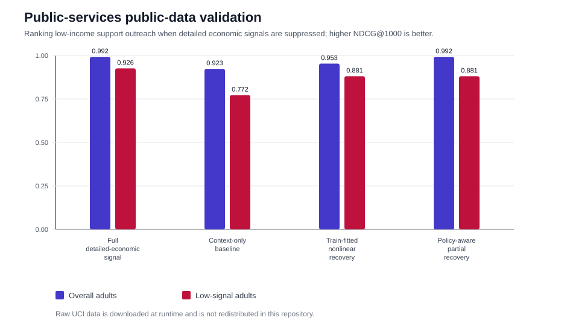
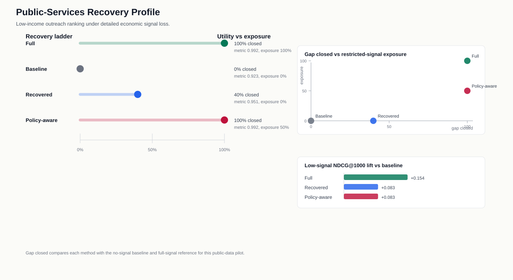

# Public Services Adult Census Validation

This public-data pilot adapts the FairPrivacySignal signal-loss pattern to a
public-service outreach setting using the UCI Adult/Census Income dataset. Adults
are ranked for low-income support outreach; detailed employment and economic
fields are treated as signals that may be unavailable under data minimization,
while coarse demographic and household context remains available.

The raw UCI files are downloaded at runtime and are not redistributed in this repository.

## Task

- **Ranked candidate:** adults for public or nonprofit support outreach
- **Restricted economic signal:** education, occupation, workclass, hours, and capital-gain/loss fields
- **Permitted context:** age, marital status, relationship, race, sex, and native country
- **Low-signal group:** adults below the median permitted-context score
- **Metric:** NDCG@1000, with binary relevance defined as income `<=50K`

## Results

| method | overall_ndcg_at_1000 | low_signal_ndcg_at_1000 | full_signal_gap_closed | economic_signal_exposure |
| --- | --- | --- | --- | --- |
| Full detailed-economic signal | 0.992 | 0.926 | 100.0% | 1.000 |
| Context-only baseline | 0.923 | 0.772 | 0.0% | 0.000 |
| Train-fitted nonlinear recovery | 0.953 | 0.881 | 43.7% | 0.000 |
| Policy-aware partial recovery | 0.992 | 0.881 | 100.0% | 0.500 |

The train-fitted nonlinear recovery path closes 43.7%
of the full-signal NDCG@1000 gap without exposing the restricted detailed
economic features at scoring time. The policy-aware partial path keeps detailed
economic signal for higher-signal records while substituting recovered signal for
low-signal records, closing 100.0%
of the same gap in this pilot.

## Recovery method comparison

| method | overall_ndcg_at_1000 | low_signal_ndcg_at_1000 | full_signal_gap_closed | economic_signal_exposure |
| --- | --- | --- | --- | --- |
| Fixed 85/15 recovery | 0.950 | 0.855 | 38.7% | 0.000 |
| Reliability-weighted recovery | 0.951 | 0.855 | 39.9% | 0.000 |
| OOF-selected nonlinear recovery | 0.953 | 0.881 | 43.7% | 0.000 |

Five-fold out-of-fold predictions on the UCI training split compare a linear
ridge reconstruction, a histogram gradient-boosted reconstruction, and a
cohort aggregate. Convex weights are selected by out-of-fold reconstruction
error among candidates that preserve low-signal NDCG. The selected ridge,
nonlinear, and cohort weights are `0.00`,
`1.00`, and `0.00`. The official test
split is not used to fit either base estimator or select the weights. Relative
to the reliability-weighted recovery method, the selected nonlinear recovery
changes held-out overall NDCG@1000 by
`+0.002650` and low-signal NDCG@1000 by
`+0.026245` while keeping restricted-signal exposure at `0.000`.

## Interpretation

This is an external public-data validation of the system shape, not a deployed
benefits or nonprofit-service model. It shows how the method can be instantiated
in a census-like public-services workflow: define detailed economic signals,
suppress them at scoring time, substitute a train-fitted reconstruction with a
richer nonlinear candidate, select it on training-only folds with a low-signal
guardrail, and measure outreach-ranking recovery. The dataset is a public income benchmark
rather than a service-interaction log, so the availability policy is simulated
for evaluation.
